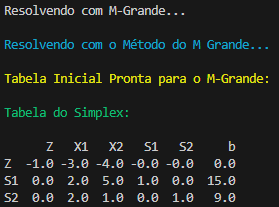
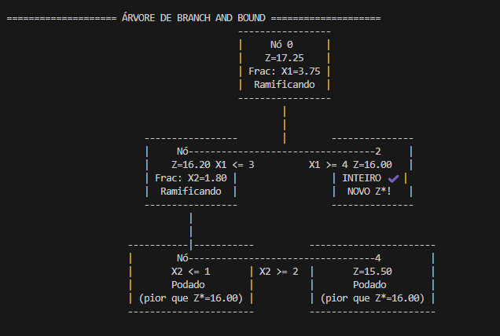

# Pesquisa Operacional - Projetos e Algoritmos

## 📖 Sobre
Este repositório é dedicado à disciplina de Pesquisa Operacional (PO). Aqui você encontrará implementações de algoritmos, soluções de problemas e exemplos práticos estudados durante o curso. 

## 🚀 Tecnologias Utilizadas
O projeto foi desenvolvido principalmente com as seguintes tecnologias:

Python 3: Linguagem principal para a implementação dos algoritmos.

## 📂 Estrutura do Repositório
O repositório está organizado da seguinte forma:
```
/
├── src/
│   ├── Trabalho1
│   │  ├── main.py
│   │  ├── problema.json
│   │  ├── requirements.txt
│   │  ├── simplex_code.py
│   │  ├── simplex_code2.py
│   │  ├── simplex_duas_fases.py
│   │  ├── simplex_m_grande.py
│   ├── Trabalho2
│   │  ├── main.py
│   │  ├── branch_and_bound.py
│   │  ├── problema.json
│   │  ├── requirements.txt
│   │  ├── simplex_code.py
│   │  ├── simplex_code2.py
│   │  ├── simplex_duas_fases.py
│   │  ├── simplex_m_grande.py
├── .gitignore          
├── LICENSE             
└── README.md           
```

## 🛠️ Instalação e Uso
Para executar os projetos localmente, siga os passos abaixo:

1. Clone o repositório:

 ```
    git clone https://github.com/DudisPires/Repository-PO.git
    cd Repository-PO

```

2. Instale as dependências:

```
pip install -r /Trabalho1/requirements.txt
```

4. Execute:
```
cd src
cd Trabalho2
python3 main.py
```
5. Escolha o método que deseja utilizar no menu:
```
1- Resolver PL com Simplex M-Grande
2- Resolver PL com Simplex Duas Fases
3- Resolver PI com Branch and Bound 
4- Sair 
```
## ⚠️ Resolução de Problemas 

- Para a inserção de problemas utilize o arquivo **problema.json** seguindo o padrão definido, como esse:

  ```
  {
  "coeficientes": [
    [1, 2],
    [2, 1]
  ],

  "independentes": [4, 5],
  "f_obj": [3, 2],
  "operadores": ["<=", ">="]
  }
  ```
## 💻 Saída no terminal

- Quando utilizando o Simplex Solver (Simplex normal, M grande ou Simplex Duas fases):

  
  
- Quando utilizando o método Branch and Bound:

  
  

